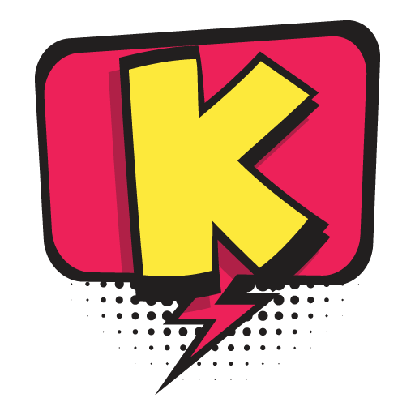

# 

## O que é :question:

O Katchin é uma extensão para Google Chrome e Opera, onde farmar moedas na 
Twitch fica muito mais fácil! Na verdade, fica fácil até demais. Basta ativar o
Katchin nas páginas dos seus Streamers desejados e o Katchin irá farmar todas as 
moedas para você, assim como salvar suas preferências.

## Próximos Passos :soon:

- [ ] Adicionar versão do README em inglês
- [x] Salvar os canais ativados no Storage do navegador
- [ ] Inserir Links nas configurações
- [x] Inserir opção de reportar problema
- [ ] Realizar testes em outros navegadores
- [x] Disparar o minerador ao ativar nas configurações
- [x] Tratamento de erros

## Problemas :exclamation:

Nada por aqui ainda, mas caso qualquer problema seja detectado basta criar uma issue

##
